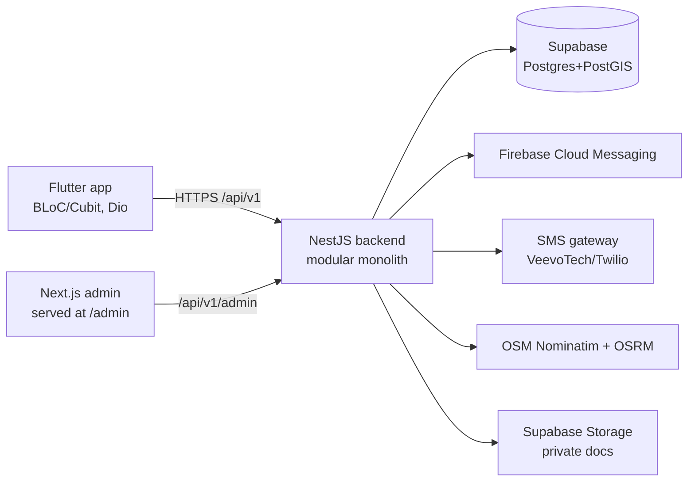

# Rideshare‑PK — Product & Engineering Documentation

> **Pakistan's Transportation Marketplace** — one account, one app, two modes
> (Passenger ↔ Driver). Cash‑first carpool/ride marketplace with a real
> request→accept/reject/counter dispatch loop, live tracking, safety, wallet,
> and push. Built as a modular monolith and shipped continuously to Fly.io.

Last updated: 2026‑07‑23 · Commission: **10%** (nominal, cash‑settled) ·
Status: **Phase‑1 vision complete and live**.

---

## 1. Quick reference

| Thing | Value |
|---|---|
| Live API | `https://rideshare-pk.fly.dev` (all routes under `/api/v1`) |
| Admin console | `https://rideshare-pk.fly.dev/admin` |
| Git repo | `https://github.com/imgrasooldev/rideshare-pk` (branch `main`) |
| Fly.io app | `rideshare-pk` (region: Singapore `sin`) |
| Database | Supabase Postgres + PostGIS (transaction pooler, port `6543`) |
| Firebase project | `rideshare-d39d0` · Android package `com.rideshare.live` |
| Local repo | `D:\claude_project\rideshare-pk` |

> Access accounts, secret locations, and how to retrieve/rotate each are in
> **§10 Access & Credentials**.

---

## 2. What the product is

A single mobile app where anyone can **travel** (passenger) or **earn**
(driver) from the same account. It is **not** limited to ride‑hailing — it's a
marketplace of transportation services organised as categories (office commute,
intercity, school van, ladies‑only, airport, corporate, events, and
coming‑soon rent‑a‑car / parcel).

**Product philosophy:** one account → one app → multiple roles → different
dashboards. A rider taps **"Switch to Driver Mode"** and the whole shell
changes (earning‑focused, no booking UI). Payments are **cash‑only for now**;
the platform records a 10% commission the driver settles back.

---

## 3. User roles & modes

- **Passenger Mode** (default): service categories, address search, ride
  search, request a seat, subscriptions, bookings, chat, receipts, SOS.
- **Driver Mode** (role `driver`/`both`): online/offline toggle, earnings,
  wallet (commission owed + settle), seat requests inbox (accept / reject /
  counter‑offer), post rides, manage seats, passenger manifest + no‑show.
- **Admin** (`is_admin`): metrics, user/ride lists, verification review queue,
  dispute queue — via the `/admin` console and `admin/*` API.

Roles on the `users` row: `rider | driver | both`. Becoming a driver flips the
account to `both` (keeps rider abilities) and enters Driver Mode.

---

## 4. Feature catalog (all shipped & live)

**Accounts & trust**
- Phone OTP auth (dev‑mode shows the code), email/password, social (Google/FB),
  password reset, JWT access/refresh.
- CNIC + licence **document upload** to private storage (signed‑URL review),
  admin verification queue.
- Two‑way **ratings** (rider↔driver), surfaced on ride cards.
- **Emergency contact** + **SOS** (logs position, SMS‑alerts the contact with a
  live‑location link), **share‑live‑trip** link.

**Discovery & booking (the dispatch loop)**
- Dynamic **category grid** (`/categories`) filtering search by vertical.
- **Address search** (any address, OpenStreetMap geocoding) + curated hubs.
- **Distance + ETA** for pickup→drop (OSRM routing, haversine fallback).
- Geo‑corridor **ride search** (PostGIS `ST_DWithin`, index‑backed, keyset
  pagination), multi‑city.
- **Booking is a request**, not instant: passenger requests a seat → driver
  **accepts** (race‑safe seat decrement) / **rejects** / **counter‑offers** a
  price → passenger accepts/declines the counter.
- **Minivan/Hiace seat‑map** (reserved vs free) + driver‑managed seat count.
- **Monthly subscriptions** for recurring routes.
- **Cancellation** with reason + policy; driver **no‑show** (frees the seat).
- **Trip receipts** (fare breakdown, cash total).

**Live trip**
- Driver starts trip → live GPS stream (WebSocket + REST fallback) → rider
  watches on a map; share token for family.

**Money**
- **10% commission** accrued off confirmed fares; **driver wallet** shows cash
  collected, commission owed, and a **settle** flow (self‑declared cash deposit
  today; auto‑deduction once digital payments land).
- Counter‑offer price flows into earnings/wallet
  (`COALESCE(offered_price, price_per_seat)`).

**Growth, comms & support**
- **In‑app chat** (rider↔driver per ride, 4s polling, inbox + unread badge).
- **Notifications** centre + **FCM push** (device‑token registration; delivery
  live now that the Firebase service account is configured).
- **Referrals** (shareable code, count, apply a friend's code).
- **Disputes / "Report a problem"** → admin queue.

**Platform**
- **Online/offline gating** (offline pauses a driver's rides in search).
- **Urdu localization** foundation + English/اردو switcher (LTR this pass).
- Admin console (Command‑Center login + Bento dashboard, light/dark).

See **§11 Roadmap / what's missing** for what's intentionally deferred.

---

## 5. Architecture

Monorepo with three apps sharing one Postgres.



- **Backend** — NestJS modular monolith. Each domain is a module (auth, users,
  rides, bookings, tracking, ratings, notifications, subscriptions, earnings,
  wallet, categories, messages, places, push, referrals, disputes, trust,
  storage). Dependency injection uses **Symbol tokens**; infra (Postgres/Redis
  vs in‑memory) is a wiring choice in `infra.module.ts` (`@Global`). Repos ship
  a Postgres impl **and** an in‑memory impl for zero‑infra dev/tests.
- **Admin** — Next.js 16 (App Router, Tailwind v4), static‑exported and served
  by the backend at `/admin`.
- **Mobile** — Flutter, BLoC/Cubit state, Dio HTTP, `flutter_map`,
  `firebase_messaging`, `flutter_localizations`.

**Key rules baked in:** race‑safe seat handling (single conditional `UPDATE` in
a transaction; only *accept* decrements), idempotent booking (`rider +
idempotencyKey`), index‑backed geo search, trust gates before posting, secrets
as config not code.

**Stack:** NestJS · Next.js 16 · Flutter · Postgres 15/PostGIS · Fly.io ·
Supabase · Firebase.

---

## 6. Data model

Base tables (`apps/backend/schema.sql`): `organizations`, `users`, `vehicles`,
`rides`, `bookings`, `trips`, `safety_events`, `ratings`, `verifications`.

Migrations (`db/migrations/`) are applied in order; they are **not** auto‑run —
apply with a one‑off `pg` script (see §9).

| Migration | Adds |
|---|---|
| `0001_init` | base schema (users, rides, bookings, trips, ratings, …) |
| `0002_*` | admin flag, verification, vehicle; cities/hubs (places) |
| `0003_*` | notifications; tracking, ratings, safety |
| `0004_*` | subscriptions; vehicle types + cash‑only |
| `0005` | email/password + social auth |
| `0006` | messages (chat) |
| `0007` | verification `doc_key` (private storage) |
| `0008` | `settlements` (driver wallet) |
| `0009` | booking requests (`requested/countered/rejected` + `offered_price`) |
| `0010` | `device_tokens` (FCM) |
| `0011` | `users.is_online` (availability) |
| `0012` | `cancel_reason` + `no_show` status |
| `0013` | `referral_code` + `referrals` |
| `0014` | `disputes` |

Notable columns: `rides.vertical` (category), `rides.origin_geo/dest_geo`
(`geography(Point)`), `users.rating_avg/rating_count` (cached, maintained by
rating writes), `users.is_online`, `bookings.status` (`requested | countered |
confirmed | rejected | cancelled | completed | no_show`).

---

## 7. API reference

Base URL: `https://rideshare-pk.fly.dev/api/v1`. Auth = `Authorization: Bearer
<accessToken>` unless noted **(public)**. Admin routes require an admin JWT.

**Auth** — `POST /auth/otp/request`, `/auth/otp/verify`, `/auth/refresh`,
`/auth/register`, `/auth/login`, `/auth/password/forgot`, `/auth/password/reset`,
`/auth/oauth/google`, `/auth/oauth/facebook`.

**Me / users** — `GET /me`, `PATCH /me`, `PATCH /me/online`.

**Places (public)** — `GET /cities`, `GET /hubs?city=`, `GET /categories`,
`GET /places/search?q=&city=`, `GET /places/route?fromLat=&fromLng=&toLat=&toLng=`.

**Rides** — `POST /rides`, `GET /rides/search`, `GET /rides/mine`,
`GET /rides/:id`, `PATCH /rides/:id/seats`.

**Bookings (dispatch loop)** — `POST /bookings` (request), `GET /bookings/mine`,
`GET /bookings/requests` (driver inbox), `POST /bookings/:id/accept`,
`/reject`, `/counter`, `/respond` (rider→counter), `/cancel`, `/no-show`,
`GET /bookings/for-ride/:rideId` (passenger manifest).

**Subscriptions** — `POST /subscriptions`, `GET /subscriptions/mine`,
`POST /subscriptions/:id/cancel`.

**Trips (tracking)** — `POST /trips/:rideId/start`, `/end`, `/location`,
`GET /trips/:rideId/location`, `GET /trips/shared/:token`.

**Ratings** — `POST /ratings`.
**Wallet** — `GET /wallet`, `GET /wallet/history`, `POST /wallet/settle`.
**Earnings** — `GET /earnings`.
**Messages** — `POST /messages`, `GET /messages/threads`, `/messages/thread`,
`/messages/unread-count`.
**Notifications** — `GET /notifications`, `POST /notifications/read-all`,
`POST /notifications/:id/read`.
**Devices (push)** — `POST /devices`.
**Referrals** — `GET /referrals/me`, `POST /referrals/apply`.
**Disputes** — `POST /disputes`, `GET /disputes/mine`, `GET /disputes/admin`
(admin), `POST /disputes/:id/resolve` (admin).
**Safety** — `POST /safety/sos`.
**Verifications** — `POST /verifications`, `GET /verifications/mine`.
**Vehicles** — `POST /vehicles`, `GET /vehicles/mine`.
**Uploads** — `POST /uploads/sign`.
**Admin** — `GET /admin/metrics`, `/admin/users`, `/admin/rides`,
`/admin/timeseries`, `GET /admin/verifications`, `/admin/verifications/:id/document`,
`POST /admin/verifications/:id`.
**Health (public)** — `GET /health`, `GET /health/ready`.

---

## 8. Running locally

**Backend** (do **not** use `npm run dev`/tsx — decorator metadata breaks):
```bash
cd apps/backend
npm install
npm run build && node dist/main.js   # env sourced from ../../.env
```
Zero‑infra: with no `DATABASE_URL`/`REDIS_URL` the app uses in‑memory repos.

**Admin**
```bash
cd apps/admin && npm install && npm run dev   # or `npm run build` -> static /admin
```

**Mobile**
```bash
cd apps/mobile && flutter pub get
flutter run -d <deviceId>     # app points at the live Fly API by default
```
Device gotcha: the test Samsung `R8VY303176E` drops to `offline/unauthorized`
when locked — `adb kill-server && adb start-server`, keep it unlocked.

---

## 9. Deploy & ops runbook

**Deploy backend + admin to Fly** (from repo root):
```bash
flyctl deploy --remote-only -a rideshare-pk    # DNS is flaky -> retry loop
```
`.dockerignore` excludes `apps/mobile` (build context ~0.5 MB). A `401` on a
guarded route means it's live. The admin static build is served at `/admin`.

**Apply a migration to Supabase** (migrations are not auto‑run). Run a one‑off
node `pg` script **inside `apps/backend/`** so `pg` resolves, reading
`DATABASE_URL` from the repo `.env`:
```js
import { readFileSync } from 'node:fs'; import pg from 'pg';
const url = readFileSync('../../.env','utf8').split(/\r?\n/)
  .find(l=>l.startsWith('DATABASE_URL=')).slice(13).trim();
const c = new pg.Client({ connectionString:url, ssl:{ rejectUnauthorized:false } });
await c.connect(); await c.query(readFileSync('../../db/migrations/00XX_x.sql','utf8'));
await c.end();
```
Note: Supabase also has a built‑in `realtime.messages` table — filter
`table_schema='public'` when inspecting.

**Set/rotate a secret** (never commit secret values):
```bash
flyctl secrets set NAME="value" -a rideshare-pk           # restarts machines
flyctl secrets set FIREBASE_SERVICE_ACCOUNT="$(cat sa.json)" -a rideshare-pk
flyctl secrets list -a rideshare-pk
```

**Build/install mobile**
```bash
cd apps/mobile && flutter build apk --debug && flutter install -d R8VY303176E
```

---

## 10. Access & Credentials

> **Security policy:** live secret *values* are intentionally **NOT** in this
> repo. They live in **Fly secrets** (backend) and the **gitignored `.env`**.
> This section documents every secret's **name, where it lives, and how to
> retrieve/rotate it** — enough to operate the system without leaking keys into
> git history. If you need the raw values written down, keep them in a
> gitignored file (e.g. `CREDENTIALS.local.md`), never in a tracked file.

**Consoles / dashboards**
| System | Where | Login |
|---|---|---|
| Fly.io | `flyctl` CLI / fly.io dashboard, app `rideshare-pk` | your Fly account |
| Supabase | supabase.com → project `fojsavsbqhczagfegdsx` | your Supabase account |
| Firebase | console.firebase.google.com → `rideshare-d39d0` | your Google account |
| GitHub | `imgrasooldev/rideshare-pk` | your GitHub account |

**App logins**
- **Demo user:** phone `03400000000` (seeded as "Ali Raza", role `both`,
  **admin**, verified, has a vehicle + bookings). With `OTP_DEV_MODE` on, the
  OTP is shown on screen / returned by the API — no SMS needed.
- **Admin console** (`/admin`): sign in with an account whose `users.is_admin =
  true` (the demo user is admin). Promote another user by setting `is_admin` in
  the DB.

**Backend secrets — Fly secrets (`flyctl secrets list -a rideshare-pk`)**
| Secret | Purpose | How to obtain / rotate |
|---|---|---|
| `DATABASE_URL` | Postgres (Supabase pooler) | Supabase → Settings → Database → Connection string (transaction pooler, port 6543); URL‑encode password |
| `JWT_ACCESS_SECRET`, `JWT_REFRESH_SECRET` | JWT signing | generate random 32B+ strings; rotating logs everyone out |
| `CNIC_ENC_KEY` | AES‑GCM key for CNIC at rest | random key; rotating without re‑encrypt invalidates stored CNICs |
| `FIREBASE_SERVICE_ACCOUNT` | FCM push send (Admin SDK JSON) | Firebase → Project settings → Service accounts → Generate new private key |
| `SUPABASE_URL`, `SUPABASE_SERVICE_KEY`, `STORAGE_BUCKET` | private doc storage | Supabase → Settings → API (service_role key is server‑only) |
| `SMS_PROVIDER` + provider keys | OTP/SOS SMS (dev by default) | VeevoTech account hash **or** Twilio SID/token/from |
| `GOOGLE_CLIENT_ID`, `FB_APP_ID`, `FB_APP_SECRET` | social login | Google/Facebook developer consoles |

**Non‑secret config** (safe): `FIREBASE_PROJECT_ID=rideshare-d39d0`,
`STORAGE_PROVIDER`, `MAPS_PROVIDER=osm`, `CITY_DEFAULT=lahore`, `OTP_DEV_MODE`,
`BOOKING_FEE_PKR`, feature flags (`FEATURE_*`, `REQUIRE_DRIVER_VERIFICATION_TO_POST`).

**Mobile / Firebase client**
- `apps/mobile/android/app/google-services.json` — Firebase **client** config
  (ships in the APK; not a server secret). Registered to package
  `com.rideshare.live`.

Full variable list with defaults: `apps/backend/src/config/config.ts` and
`.env.example`.

---

## 11. Roadmap / what's missing

**Deferred (blocked on a digital‑payments rail — JazzCash/Easypaisa/Raast):**
rider wallet & top‑ups, promo‑code *discounts*, referral *credit* redemption,
enforced commission collection / auto‑deduction, driver withdrawals.

**Foundations shipped, need finishing:** full Urdu string coverage + RTL;
end‑to‑end FCM push verification; trip‑completion → "rate now" prompt (bookings
don't auto‑complete yet); drawing the route polyline on the live map; admin UI
for the disputes/KYC/refunds queues.

**Not started (customer wishlist):** instant‑book option; rupee fare estimate
before requesting; driver+vehicle card + masked call button on accept;
book‑for‑family/guest; female‑driver preference; saved routes / favourite
drivers; pickup‑OTP enforcement at trip start.

**Bigger vision (Phase 3+):** Corporate / School / Fleet‑owner B2B portals with
billing; parcel/courier, truck/loader, ambulance verticals (taxonomy exists,
flows don't).

**Platform/ops:** background jobs (renewals, doc‑expiry reminders, stale‑request
timeouts); observability (error tracking, rate limiting); fraud/anti‑collusion;
chat moderation.

**Non‑code (business):** liquidity/cold‑start seeding & launch playbook;
regulatory (NADRA CNIC integration, route permits, PTA SMS mask, FBR invoicing,
insurance).

---

## 12. Repo layout

```
apps/backend    NestJS API (modular monolith) + serves /admin
apps/admin      Next.js 16 admin console (static export)
apps/mobile     Flutter app (BLoC), package com.rideshare.live
db/migrations   ordered SQL migrations 0001–0014
docs/           this documentation
.env            gitignored — local secrets (see §10)
fly.toml        Fly.io app config (rideshare-pk)
```
